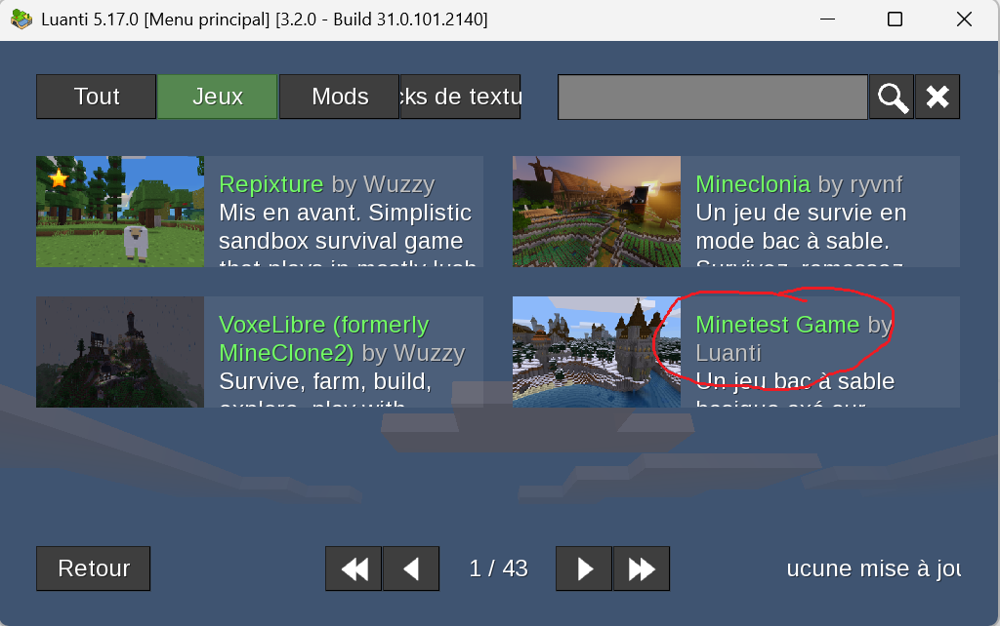
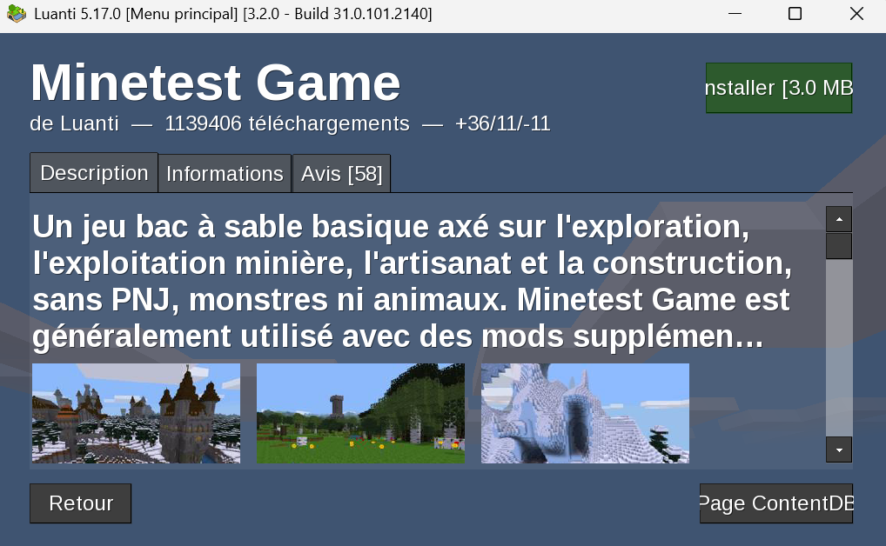
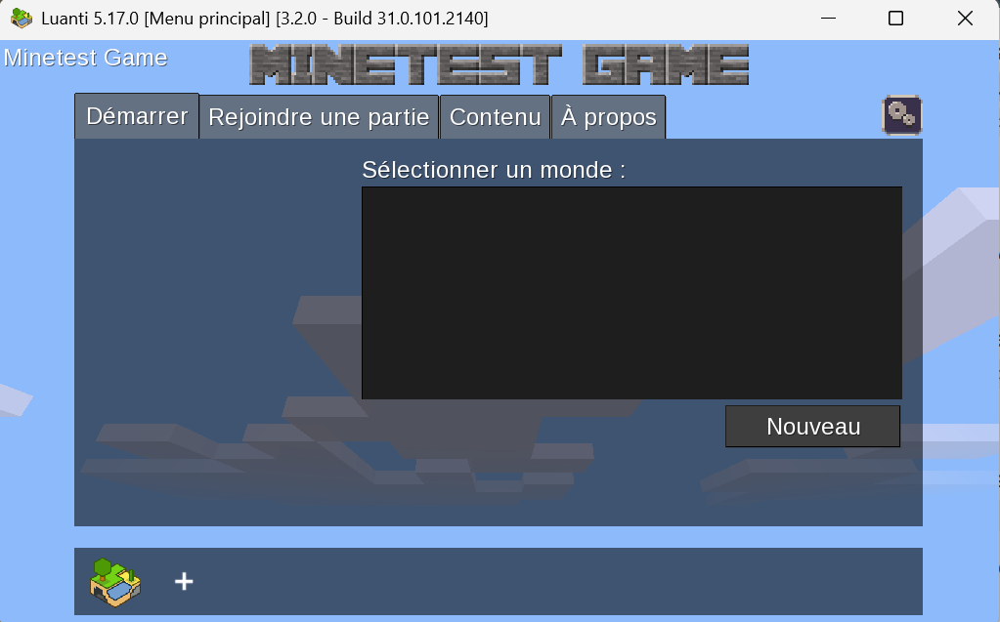
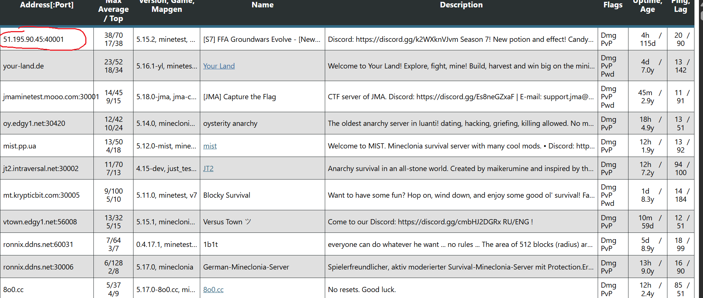
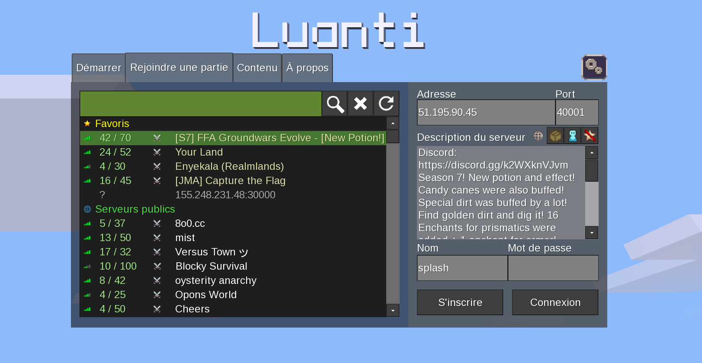
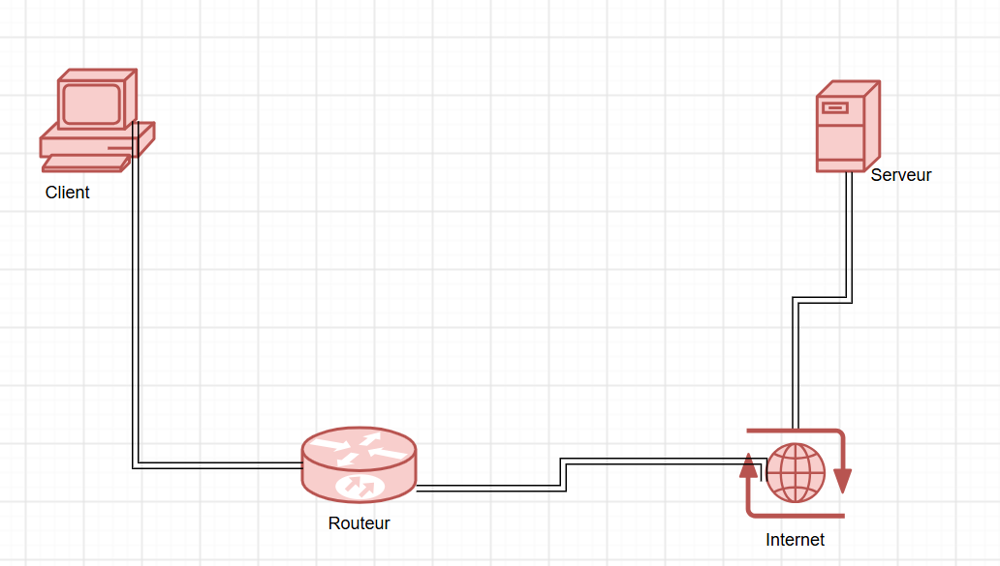

# Installation du client Luanti
 Voici les différents étapes nécessaires pour installer client Luanti
- Télécharger Luanti
-  Installer le logiciel
- lancer le logiciel

# L'installation de Minetest
1) Choisir d'installer Minetest ou Mineclonia
2) Installer Minetest

# Tester la connexion à un serveur Minetest distant
1) Lancer Minetest
2) Dans l'accueil, cliquez sur Rejoindre une partie

3) Remplir adresse
4) Remplir le port

5) Remplir le nom et le mot de passe (s'inscrire)

# Explication de l'adresse
1) Adresse IP:  51.195.90.45
2) version : IPV4
3) Classe: classe A
4) type: publique et statique
